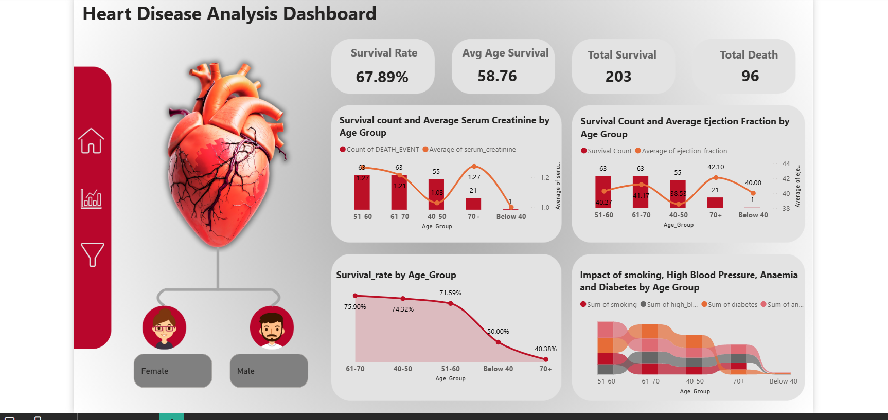

# Clinical Risk Analytics Dashboard

> Analysing heart disease survival patterns across 299 patients using Power BI — enabling age-based clinical risk stratification.


---

## Overview

This project analyses a heart disease dataset of 299 patient records using Power BI to uncover survival trends, risk patterns, and correlations between health metrics. The interactive dashboard enables healthcare data storytelling through KPIs, dynamic filters, and age-group breakdowns — supporting data-driven clinical insights.

**Patients analysed: 299 | Survival rate: 67.89% | Age groups: 5**

---

## Dashboard Preview

<!-- Add screenshot below -->


---

## Key Insights

| Finding | Detail |
|---|---|
| Overall survival rate | **67.89%** (203 survived, 96 deaths) |
| Average age of survivors | **58.76 years** |
| Highest risk age group | **51–60** (most death events recorded) |
| Lowest survival rate | **70+ age group — 40.38%** |
| Highest survival rate | **61–70 age group — 75.90%** |
| Key risk factors | Smoking, high blood pressure, anaemia, diabetes |

---

## Dashboard Features

- KPI cards: Survival Rate, Avg Age Survival, Total Survival, Total Death
- Combo charts: Survival count vs Average Serum Creatinine by Age Group
- Combo charts: Survival count vs Average Ejection Fraction by Age Group
- Line chart: Survival rate trend across age groups
- Area chart: Impact of smoking, high blood pressure, anaemia, and diabetes by age group
- Gender filter: Female / Male breakdown
- Fully interactive slicers and dynamic visuals

---

## Tech Stack

| Tool | Purpose |
|---|---|
| Power BI Desktop | Dashboard design & visualisation |
| DAX | Calculated measures and KPIs |
| Power Query | Data cleaning & transformation |
| Excel | Initial data exploration |

---

## DAX Measures Used

```dax
Survival Rate = DIVIDE(COUNTROWS(FILTER(heart_data, heart_data[DEATH_EVENT] = 0)),
                       COUNTROWS(heart_data)) * 100

Avg Age Survival = CALCULATE(AVERAGE(heart_data[age]),
                              heart_data[DEATH_EVENT] = 0)

Total Death = COUNTROWS(FILTER(heart_data, heart_data[DEATH_EVENT] = 1))
```

---

## Project Structure

```
Clinical-Risk-Dashboard/
│
├── Heart_Disease_Dashboard.pbix   # Power BI dashboard file
├── data/
│   └── heart_failure_clinical.csv # Dataset (299 records)
├── screenshots/
│   └── dashboard.png              # Dashboard preview
└── README.md
```

---

## How to Use

1. Download `Heart_Disease_Dashboard.pbix`
2. Open in **Power BI Desktop** (free download from Microsoft)
3. Use the gender filter and age group slicers to explore patterns
4. All visuals update dynamically based on your selection

---

## Dataset

- **Source**: Heart Failure Clinical Records Dataset
- **Records**: 299 patients
- **Features**: Age, gender, serum creatinine, ejection fraction, smoking, diabetes, anaemia, high blood pressure, death event

---

## Author

**Asif Iqbal Shaikh**
📧 sasif9226@gmail.com
🔗 [LinkedIn](https://www.linkedin.com/in/asif-shaikh-5487a9270)
🐙 [GitHub](https://github.com/AsifShaikh-ui)
